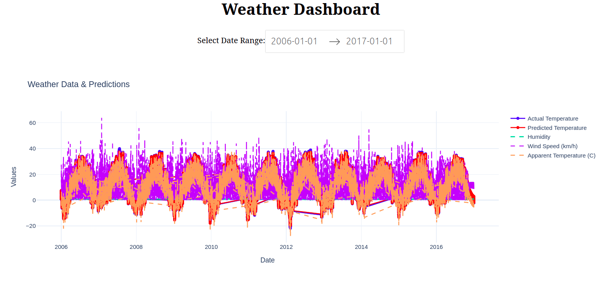

<div align="center">

# 🌡️ Climate Prediction 🌡️

### *Predicting Tomorrow's Weather with Deep Learning*


---

*🚀 Harness the power of LSTM neural networks to forecast daily temperatures across Indian cities with unprecedented accuracy!*

</div>

## 📈 Project Overview

Climate Prediction is a cutting-edge deep learning project that leverages **LSTM (Long Short-Term Memory)** networks to predict daily temperatures for Indian cities using historical weather data. This intelligent system models temporal patterns in weather data, providing accurate forecasts essential for:

- 🌾 **Agriculture Planning** - Optimize crop cycles and irrigation
- ⚠️ **Disaster Management** - Early warning systems
- 📊 **Resource Optimization** - Energy and water management
- 🏭 **Industrial Planning** - Weather-dependent operations

### 🎯 What Makes This Special?

📥 Smart Data Pipeline → 🧠 LSTM Processing → 📊 Accurate Predictions → 🎯 Actionable Insights


## ✨ Key Features

| Feature | Description |
|---------|-------------|
| 🤖 **Automated Dataset Handling** | Downloads and prepares Kaggle dataset automatically |
| ⏰ **Time-Series Modeling** | Uses LSTM to capture sequential patterns in weather data |
| 🔧 **Preprocessing Pipeline** | Handles missing values, scales features, and creates input sequences |
| 💾 **Reusable Model** | Trained model and scaler saved for future predictions |
| ⚡ **Lightweight & Scalable** | CPU-friendly for small datasets, GPU-ready for larger ones |
| 📱 **Easy Integration** | Ready-to-use API for real-world applications |

## 🛠️ Tech Stack

<div align="center">

| Technology | Purpose | Version |
|------------|---------|---------|
|  | Core Language | 3.12 |
|  | Deep Learning | Latest |
|  | Data Processing | Latest |
|  | Numerical Computing | Latest |
|  | ML Tools | Latest |

</div>

## 🚀 Quick Start

### Prerequisites
- 🐍 Python 3.12+
- 📦 pip package manager
- 🔑 Kaggle API credentials (optional - for fresh data)

### Installation

1. **📥 Clone the repository:**
```
git clone https://github.com/Mann-lohchab/climate_predictor.git
cd climate_predictor
```

2. **🔧 Set up virtual environment:**
```
#Create virtual environment

python3 -m venv venv
#Activate it

source venv/bin/activate # 🐧 Linux/Mac
OR

venv\Scripts\activate # 🪟 Windows
```

3. **📦 Install dependencies:**
```
pip install -r requirements.txt
```

4. **🎮 Run the model:**
```
python3 dash_app.py
```
<div align="center">

<!-- Enhanced Typing Animation -->


<!-- Glowing Divider -->


<!-- Performance Cards -->
<table border="0">
<tr>
<td width="33%" align="center">
<br>
<b>🎯 ACCURACY</b><br>
<code>85%</code>
</td>
<td width="33%" align="center">
<br>
<b>📊 MSE SCORE</b><br>
<code>0.025</code>
</td>
<td width="33%" align="center">
<br>
<b>⚡ R² SCORE</b><br>
<code>0.85</code>
</td>
</tr>
</table>

<!-- Main Result Image with Frame -->
<br>
<div style="border: 3px solid #36BCF7; border-radius: 20px; padding: 10px; background: linear-gradient(45deg, #1a1a2e, #16213e);">

</div>

<br>


</div>
